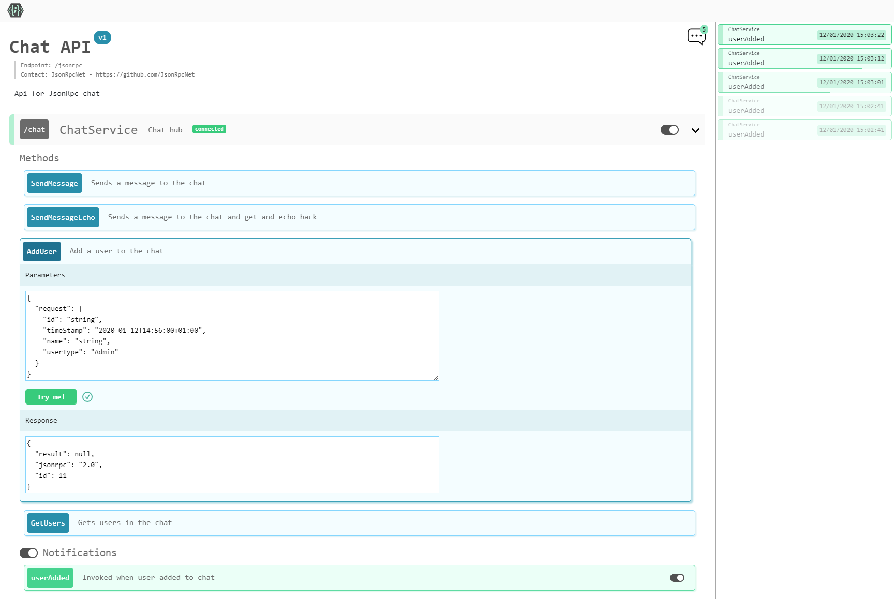

⚠️ Under construction ⚠️

## About

The JsonRpcNet User Interface is a web client that generates an JSON RPC API documentation page based on a provided API JSON description. The UI displays information about the available endpoints and allows you to interact with them via websockets, by sending JSON RPC 2.0 requests and displaying responses.

